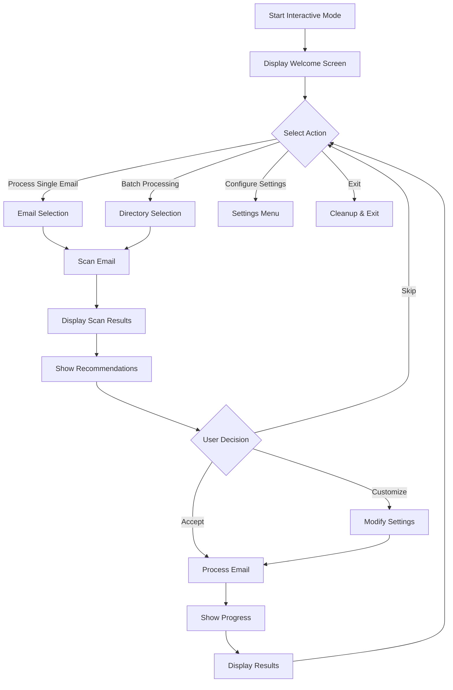

# Phase 3.5: Interactive CLI Mode Design Document

## Overview

The Interactive CLI Mode enhances the Email Parser's user experience by providing an intuitive, guided interface for email processing. This mode offers smart recommendations, real-time progress tracking, and pre-configured processing profiles while maintaining full backward compatibility with the existing command-line interface.

## Architecture Overview

### Component Hierarchy

```
email_parser/
├── cli/
│   ├── __init__.py
│   ├── interactive.py      # Main interactive CLI controller
│   └── prompts.py          # Interactive prompt utilities
├── core/
│   ├── scanner.py          # Email content scanner
│   └── recommender.py      # Processing recommendation engine
├── utils/
│   ├── progress.py         # Progress tracking system
│   └── display.py          # Terminal display utilities
└── config/
    └── profiles.py         # Pre-defined configuration profiles
```

## Interaction Flow

### 1. Entry Point

```
$ python -m email_parser --interactive
```

### 2. Main Interactive Loop



### 3. User Experience Flow

#### 3.1 Welcome Screen
```
╔══════════════════════════════════════════════════════════════╗
║                   Email Parser v2.2.0                        ║
║                  Interactive Mode                            ║
╠══════════════════════════════════════════════════════════════╣
║                                                              ║
║  Welcome to the Email Parser Interactive Mode!              ║
║                                                              ║
║  What would you like to do?                                 ║
║                                                              ║
║  [1] Process a single email                                 ║
║  [2] Batch process emails from a directory                  ║
║  [3] Configure processing settings                          ║
║  [4] View/manage configuration profiles                     ║
║  [5] Exit                                                   ║
║                                                              ║
║  Select an option (1-5):                                    ║
╚══════════════════════════════════════════════════════════════╝
```

#### 3.2 Email Scanning Results
```
Scanning email: quarterly_report.eml
━━━━━━━━━━━━━━━━━━━━━━━━━━━━━━━━━━━━━━━━━━━━━━━ 100% Complete

📧 Email Analysis Results:
├── Subject: Q4 2024 Financial Report
├── From: cfo@company.com
├── Date: 2025-01-15
├── Size: 2.4 MB
└── Attachments: 3 found
    ├── 📄 Q4_Report.pdf (1.2 MB) - Complex PDF with images
    ├── 📊 Financial_Data.xlsx (156 KB) - Multi-sheet workbook
    └── 📝 Executive_Summary.docx (89 KB) - Formatted document

⏱️  Estimated processing time: 45-60 seconds
```

#### 3.3 Processing Recommendations
```
🤖 Processing Recommendations:

Based on the email content, we recommend:

✓ PDF Conversion (MistralAI OCR)
  - Detected complex PDF with charts and images
  - Recommended mode: "all" (text + images)
  
✓ Excel Conversion
  - Convert to CSV for data analysis
  - Preserve all sheets
  
✓ DOCX Conversion
  - Extract to markdown with formatting
  - Enable AI-ready chunking for large documents
  - Extract embedded images

📋 Suggested Profile: "comprehensive"

Would you like to:
[A]ccept recommendations
[C]ustomize settings
[S]elect different profile
[K]ip this email
```

#### 3.4 Progress Display
```
Processing: quarterly_report.eml

Overall Progress: 
[████████████░░░░░░░░] 60% | 3/5 tasks | ETA: 00:25

Current Tasks:
✓ Email parsing complete
✓ Metadata extraction complete
▶ Converting PDF (page 3/10)...
  └─ [██████░░░░] 60% | Processing images...
○ Converting Excel spreadsheet
○ Converting DOCX document

Memory: 124 MB | CPU: 23% | Time Elapsed: 00:35
```

## Command Structure

### Interactive Mode Commands

```bash
# Enter interactive mode
python -m email_parser --interactive
python -m email_parser -i

# Enter with specific profile
python -m email_parser --interactive --profile comprehensive

# Enter with custom config
python -m email_parser --interactive --config custom.yaml

# Quick process with recommendations
python -m email_parser --interactive --quick email.eml
```

### Direct Mode (Backward Compatible)

```bash
# All existing commands remain unchanged
python -m email_parser process --input email.eml --output output/
python -m email_parser batch --input emails/ --output output/
```

## Configuration Profiles

### Profile Schema

```yaml
profile_name:
  description: "Human-readable description"
  display_name: "Name shown in UI"
  priority: 1  # Sort order in profile list
  
  # Processing settings
  processing:
    convert_pdf: true
    convert_excel: true
    convert_docx: true
    extract_metadata: true
  
  # PDF-specific settings
  pdf_conversion:
    extraction_mode: "all"
    extract_images: true
    image_quality: 85
  
  # DOCX-specific settings
  docx_conversion:
    enable_chunking: true
    chunk_strategy: "semantic"
    extract_images: true
    preserve_styles: true
  
  # Performance settings
  performance:
    parallel_processing: true
    max_workers: 4
    memory_limit: "500MB"
```

### Built-in Profiles

1. **Quick Processing** (`quick`)
   - Minimal conversions for speed
   - Text extraction only
   - No image processing

2. **Comprehensive** (`comprehensive`)
   - All conversions enabled
   - Full feature set
   - Balanced performance

3. **AI-Ready** (`ai_ready`)
   - Optimized for LLM processing
   - Semantic chunking
   - Clean markdown output

4. **Archive Mode** (`archive`)
   - Preserve original formatting
   - Extract all content
   - Generate searchable index

5. **Development** (`dev`)
   - Verbose logging
   - Debug information
   - Performance metrics

## Scanner Component Design

### Email Scanner API

```python
@dataclass
class ScanResult:
    """Results from email scanning."""
    email_path: Path
    subject: str
    sender: str
    date: datetime
    size_bytes: int
    attachments: List[AttachmentInfo]
    complexity_score: float
    estimated_time: timedelta
    recommendations: List[str]
    warnings: List[str]

@dataclass
class AttachmentInfo:
    """Information about an email attachment."""
    filename: str
    content_type: str
    size_bytes: int
    file_type: FileType
    complexity: ComplexityLevel
    features: Set[str]  # e.g., {"images", "tables", "forms"}
```

### Scanning Process

1. **Quick Analysis** (< 1 second)
   - File size and type detection
   - MIME structure parsing
   - Attachment enumeration

2. **Deep Analysis** (1-5 seconds)
   - Content complexity assessment
   - Feature detection (images, tables, forms)
   - Processing time estimation

3. **Recommendation Generation**
   - Based on content analysis
   - User preferences
   - System capabilities

## Progress Tracking System

### Progress Events

```python
class ProgressEvent(Enum):
    TASK_START = "task_start"
    TASK_UPDATE = "task_update"
    TASK_COMPLETE = "task_complete"
    SUBTASK_START = "subtask_start"
    SUBTASK_UPDATE = "subtask_update"
    SUBTASK_COMPLETE = "subtask_complete"
    WARNING = "warning"
    ERROR = "error"
```

### Display Modes

1. **Rich Mode** (with `rich` library)
   - Live progress bars
   - Nested task tracking
   - Colored output
   - Spinner animations

2. **Simple Mode** (fallback)
   - Text-based progress
   - Percentage indicators
   - Status messages
   - Compatible with all terminals

3. **Quiet Mode**
   - Minimal output
   - Only errors and warnings
   - Final summary

## Error Handling

### Interactive Error Recovery

```
⚠️  Error: Failed to convert PDF attachment

The PDF converter encountered an error:
MistralAI API key not configured

What would you like to do?
[R]etry with different settings
[S]kip this attachment
[C]onfigure API key now
[A]bort processing
```

### Graceful Degradation

1. **Missing Dependencies**
   - Detect at startup
   - Offer installation guidance
   - Disable affected features

2. **API Failures**
   - Retry with backoff
   - Suggest alternatives
   - Continue with other tasks

3. **Resource Constraints**
   - Monitor memory usage
   - Throttle processing
   - Warn before limits

## Performance Considerations

### Responsiveness Goals

- Startup time: < 500ms
- Scan time: < 5s per email
- UI response: < 100ms
- Progress updates: 10 Hz

### Resource Management

- Memory limit: 500MB default
- CPU throttling: Optional
- Disk I/O: Buffered writes
- Network: Connection pooling

## Security Considerations

### Input Validation

- Path traversal prevention
- File size limits
- MIME type verification
- Malware scanning hooks

### Sensitive Data Handling

- No credentials in profiles
- Secure prompt for API keys
- Memory clearing after use
- Audit logging options

## Testing Strategy

### User Experience Testing

1. **Scenario Testing**
   - New user first run
   - Power user workflows
   - Error recovery paths
   - Performance edge cases

2. **Accessibility Testing**
   - Screen reader compatibility
   - Keyboard navigation
   - Color blind modes
   - Terminal compatibility

### Automated Testing

1. **Unit Tests**
   - Component isolation
   - Mock interactions
   - Edge case coverage

2. **Integration Tests**
   - Full workflows
   - Profile switching
   - Error scenarios

3. **Performance Tests**
   - Load testing
   - Memory profiling
   - Response timing

## Future Enhancements

### Version 3.6 Possibilities

1. **Web UI Mode**
   - Browser-based interface
   - Drag-and-drop support
   - Visual preview

2. **Plugin System**
   - Custom processors
   - Third-party integrations
   - Extension marketplace

3. **Cloud Integration**
   - Remote processing
   - Collaborative features
   - Result sharing

4. **AI Assistant**
   - Natural language commands
   - Learning from usage
   - Predictive settings

## Implementation Timeline

### Week 1: Foundation (Days 1-7)
- Day 1-2: Scanner implementation
- Day 3-4: Interactive CLI framework
- Day 5-6: Configuration profiles
- Day 7: Integration planning

### Week 2: Core Features (Days 8-14)
- Day 8-9: Progress tracking
- Day 10-11: Recommendation engine
- Day 12-13: Error handling
- Day 14: Polish and refinement

### Week 3: Testing & Documentation (Days 15-21)
- Day 15-16: Test suite
- Day 17-18: Documentation
- Day 19-20: Performance tuning
- Day 21: Release preparation

## Success Metrics

1. **User Adoption**
   - 50% of users try interactive mode
   - 80% continue using it
   - 90% satisfaction rate

2. **Performance**
   - < 5s email scan time
   - < 100ms UI response
   - < 500MB memory usage

3. **Quality**
   - Zero critical bugs
   - 95% test coverage
   - All features documented

4. **Maintainability**
   - Clear component boundaries
   - Comprehensive logging
   - Easy to extend