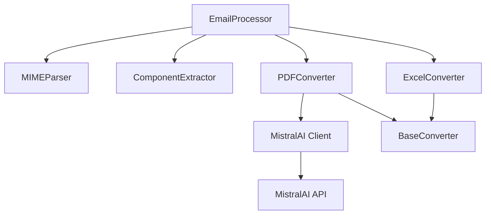

# Technical Specification Document
# Enterprise Email Parser with PDF to Markdown Conversion

**Version:** 2.0.0  
**Date:** 2025-06-21  
**Author:** Alexander Presto  
**Status:** In Development

## Table of Contents

1. [Introduction](#introduction)
2. [System Architecture](#system-architecture)
3. [Component Design](#component-design)
4. [API Integration](#api-integration)
5. [Data Flow](#data-flow)
6. [Security Design](#security-design)
7. [Performance Specifications](#performance-specifications)
8. [Error Handling](#error-handling)
9. [Testing Strategy](#testing-strategy)
10. [Deployment Architecture](#deployment-architecture)

## 1. Introduction

### 1.1 Purpose
This document provides the technical specifications for integrating PDF to Markdown conversion functionality using MistralAI OCR into the Enterprise Email Parser system.

### 1.2 Scope
The specification covers the technical implementation of PDF processing capabilities, including architecture changes, new components, API integration, and system modifications.

### 1.3 Technology Stack
- **Language**: Python 3.8+
- **PDF Processing**: MistralAI OCR API
- **Dependencies**: mistralai>=1.5.2, pypdf2>=3.0.0
- **Testing**: pytest, unittest.mock
- **Documentation**: Sphinx, docstrings

## 2. System Architecture

### 2.1 High-Level Architecture

```
┌─────────────────────────────────────────────────────────────┐
│                    Email Parser System                       │
├─────────────────────────────────────────────────────────────┤
│                                                             │
│  ┌─────────────┐  ┌──────────────┐  ┌─────────────────┐  │
│  │   CLI/API   │  │ Email Parser │  │ Output Manager  │  │
│  └──────┬──────┘  └──────┬───────┘  └────────┬────────┘  │
│         │                 │                    │           │
│  ┌──────▼──────────────────▼──────────────────▼────────┐  │
│  │              Core Processing Engine                  │  │
│  │  ┌────────────┐  ┌───────────┐  ┌────────────────┐ │  │
│  │  │MIME Parser │  │Extractors │  │  Converters    │ │  │
│  │  └────────────┘  └───────────┘  │ ┌────────────┐ │ │  │
│  │                                  │ │Excel Conv. │ │ │  │
│  │                                  │ └────────────┘ │ │  │
│  │                                  │ ┌────────────┐ │ │  │
│  │                                  │ │ PDF Conv.  │ │ │  │
│  │                                  │ └─────┬──────┘ │ │  │
│  │                                  └───────┼─────────┘ │  │
│  └──────────────────────────────────────────┼──────────┘  │
│                                             │              │
└─────────────────────────────────────────────┼──────────────┘
                                              │
                        ┌─────────────────────▼──────────────┐
                        │      MistralAI OCR API             │
                        └────────────────────────────────────┘
```
### 2.2 Component Architecture

```python
# Component hierarchy
email_parser/
├── converters/
│   ├── __init__.py
│   ├── base_converter.py      # Abstract base class
│   ├── excel_converter.py     # Existing Excel converter
│   └── pdf_converter.py       # New PDF converter
├── core/
│   ├── email_processor.py     # Main processor (updated)
│   ├── mime_parser.py
│   └── component_extractor.py
└── utils/
    ├── file_utils.py
    └── security_utils.py
```

### 2.3 Module Dependencies



## 3. Component Design

### 3.1 Base Converter Interface

```python
from abc import ABC, abstractmethod
from typing import Dict, Any, Optional, List, Callable

class BaseConverter(ABC):
    """Abstract base class for all file converters."""
    
    @abstractmethod
    def is_supported_file(self, filename: str, content_type: Optional[str] = None) -> bool:
        """Check if the converter supports this file type."""
        pass
    
    @abstractmethod
    def convert(
        self,
        file_path: str,
        original_filename: str,
        secure_filename: str,
        email_id: str,
        config: Dict[str, Any],
        prompt_callback: Optional[Callable] = None
    ) -> List[Dict[str, Any]]:
        """Convert the file and return conversion results."""
        pass
    
    @abstractmethod
    def detect_file_type(self, content: bytes) -> bool:
        """Detect if content matches this converter's file type."""
        pass
```

### 3.2 PDF Converter Class

```python
from typing import Dict, Any, Optional, List, Callable, Tuple
import logging
from mistralai import Mistral
from email_parser.converters.base_converter import BaseConverter
from email_parser.exceptions import PDFConversionError

class PDFConverter(BaseConverter):
    """Converts PDF files to Markdown using MistralAI OCR."""
    
    def __init__(self, output_dir: str, config: Dict[str, Any]):
        """
        Initialize PDF converter.
        
        Args:
            output_dir: Directory for saving converted files
            config: Configuration dictionary containing:
                - mistralai_api_key: API key for MistralAI
                - pdf_mode: 'text', 'images', or 'all'
                - image_limit: Maximum number of images (0 = no limit)
                - image_min_size: Minimum image size in pixels
                - paginate: Add page separators
        """
        self.output_dir = output_dir
        self.config = config
        self.logger = logging.getLogger(__name__)
        
        # Initialize MistralAI client
        self.client = None
        if config.get('mistralai_api_key'):
            self.client = Mistral(api_key=config['mistralai_api_key'])
    
    def is_supported_file(self, filename: str, content_type: Optional[str] = None) -> bool:
        """Check if file is a PDF."""
        if filename:
            return filename.lower().endswith('.pdf')
        
        if content_type:
            return content_type in [
                'application/pdf',
                'application/x-pdf',
                'application/octet-stream'  # With PDF check
            ]
        
        return False
    
    def detect_file_type(self, content: bytes) -> bool:
        """Detect PDF by file signature."""
        return content.startswith(b'%PDF')
```

### 3.3 OCR Processing Methods

```python
class PDFConverter(BaseConverter):
    # ... previous methods ...
    
    async def _process_with_ocr(
        self,
        file_path: str,
        extraction_mode: str
    ) -> Tuple[str, Dict[str, bytes], Dict[str, Any]]:
        """
        Process PDF with MistralAI OCR.
        
        Args:
            file_path: Path to PDF file
            extraction_mode: 'text', 'images', or 'all'
            
        Returns:
            Tuple of (markdown_text, images_dict, metadata)
        """
        # Read file content
        with open(file_path, 'rb') as f:
            file_content = f.read()
        
        # Upload to MistralAI
        file_upload = await self.client.files.upload({
            'file': {
                'fileName': os.path.basename(file_path),
                'content': file_content
            },
            'purpose': 'ocr'
        })
        
        # Get signed URL
        signed_url = await self.client.files.get_signed_url({
            'fileId': file_upload.id
        })
        
        # Configure OCR options
        include_images = extraction_mode in ['images', 'all']
        include_text = extraction_mode in ['text', 'all']
        
        # Process with OCR
        ocr_response = await self.client.ocr.process({
            'model': 'mistral-ocr-latest',
            'document': {
                'type': 'document_url',
                'documentUrl': signed_url.url
            },
            'includeImageBase64': include_images,
            'imageLimit': self.config.get('image_limit', 0) or None,
            'imageMinSize': self.config.get('image_min_size', 0) or None
        })
        
        # Parse results
        return self._parse_ocr_results(ocr_response, include_text)
```

## 4. API Integration

### 4.1 MistralAI Client Configuration

```python
class MistralAIConfig:
    """Configuration for MistralAI API integration."""
    
    def __init__(self, api_key: str, **kwargs):
        self.api_key = api_key
        self.timeout = kwargs.get('timeout', 30)
        self.max_retries = kwargs.get('max_retries', 3)
        self.base_url = kwargs.get('base_url', 'https://api.mistral.ai')
    
    def create_client(self) -> Mistral:
        """Create configured MistralAI client."""
        return Mistral(
            api_key=self.api_key,
            timeout=self.timeout,
            max_retries=self.max_retries
        )
```

### 4.2 API Error Handling

```python
from enum import Enum
from typing import Optional

class MistralAIErrorCode(Enum):
    """MistralAI API error codes."""
    RATE_LIMIT = "rate_limit_exceeded"
    INVALID_KEY = "invalid_api_key"
    FILE_TOO_LARGE = "file_too_large"
    NETWORK_ERROR = "network_error"
    OCR_FAILED = "ocr_processing_failed"

class MistralAIError(Exception):
    """MistralAI API error with context."""
    
    def __init__(
        self,
        message: str,
        error_code: MistralAIErrorCode,
        retry_after: Optional[int] = None
    ):
        super().__init__(message)
        self.error_code = error_code
        self.retry_after = retry_after
```

### 4.3 Retry Logic

```python
import asyncio
from typing import TypeVar, Callable, Optional

T = TypeVar('T')

async def retry_with_backoff(
    func: Callable[..., T],
    max_retries: int = 3,
    initial_delay: float = 1.0,
    backoff_factor: float = 2.0,
    max_delay: float = 60.0
) -> T:
    """
    Retry function with exponential backoff.
    
    Args:
        func: Async function to retry
        max_retries: Maximum number of retries
        initial_delay: Initial delay in seconds
        backoff_factor: Multiplier for delay
        max_delay: Maximum delay in seconds
    """
    delay = initial_delay
    
    for attempt in range(max_retries + 1):
        try:
            return await func()
        except MistralAIError as e:
            if attempt == max_retries:
                raise
            
            if e.error_code == MistralAIErrorCode.RATE_LIMIT:
                delay = e.retry_after or delay
            
            await asyncio.sleep(min(delay, max_delay))
            delay *= backoff_factor
```

## 5. Data Flow

### 5.1 PDF Processing Flow

```
1. Email Processor receives email with PDF attachment
2. Attachment identified as PDF by PDFConverter
3. PDF saved to temporary location
4. PDFConverter invoked with configuration
5. MistralAI client uploads PDF
6. OCR processing requested
7. Results parsed into markdown and images
8. Images decoded and saved to filesystem
9. Markdown updated with image links
10. Results returned to Email Processor
11. Summary updated with PDF content
```

### 5.2 Data Structures

```python
# OCR Result Structure
@dataclass
class OCRResult:
    """Result from OCR processing."""
    success: bool
    markdown: Optional[str]
    images: Dict[str, bytes]  # filename -> image data
    metadata: Dict[str, Any]
    error: Optional[str]

# PDF Conversion Result
@dataclass
class PDFConversionResult:
    """Result of PDF conversion."""
    pdf_filename: str
    markdown_path: str
    image_paths: List[str]
    page_count: int
    extraction_mode: str
    processing_time: float
```

### 5.3 Image Handling

```python
class ImageProcessor:
    """Process and save images from OCR results."""
    
    @staticmethod
    def decode_base64_image(
        base64_data: str,
        image_id: str
    ) -> Tuple[bytes, str]:
        """
        Decode base64 image data.
        
        Returns:
            Tuple of (image_bytes, format_extension)
        """
        # Remove data URL prefix if present
        if ',' in base64_data:
            header, data = base64_data.split(',', 1)
            # Extract format from header
            format_match = re.match(r'data:image/(\w+);base64', header)
            format_ext = format_match.group(1) if format_match else 'png'
        else:
            data = base64_data
            format_ext = 'png'
        
        # Decode base64
        image_bytes = base64.b64decode(data)
        return image_bytes, format_ext
    
    @staticmethod
    def save_image(
        image_data: bytes,
        output_dir: str,
        base_name: str,
        image_id: str,
        format_ext: str
    ) -> str:
        """Save image to filesystem."""
        filename = f"{base_name}_img_{image_id}.{format_ext}"
        filepath = os.path.join(output_dir, filename)
        
        with open(filepath, 'wb') as f:
            f.write(image_data)
        
        return filepath
```

## 6. Security Design

### 6.1 Input Validation

```python
class PDFSecurityValidator:
    """Validate PDF files for security."""
    
    MAX_FILE_SIZE = 100 * 1024 * 1024  # 100MB
    VALID_SIGNATURES = [b'%PDF']
    
    @classmethod
    def validate_pdf(cls, file_path: str) -> None:
        """
        Validate PDF file for security issues.
        
        Raises:
            SecurityError: If validation fails
        """
        # Check file size
        file_size = os.path.getsize(file_path)
        if file_size > cls.MAX_FILE_SIZE:
            raise SecurityError(f"File too large: {file_size} bytes")
        
        # Check file signature
        with open(file_path, 'rb') as f:
            signature = f.read(4)
        
        if not any(signature.startswith(sig) for sig in cls.VALID_SIGNATURES):
            raise SecurityError("Invalid PDF signature")
        
        # Check for embedded JavaScript or forms
        cls._check_pdf_content(file_path)
    
    @staticmethod
    def _check_pdf_content(file_path: str) -> None:
        """Check PDF content for security issues."""
        try:
            import pypdf2
            
            with open(file_path, 'rb') as f:
                pdf = pypdf2.PdfReader(f)
                
                # Check for JavaScript
                if '/JavaScript' in pdf.trailer:
                    raise SecurityError("PDF contains JavaScript")
                
                # Check for forms
                if '/AcroForm' in pdf.trailer:
                    logging.warning("PDF contains forms")
        
        except Exception as e:
            logging.warning(f"Could not analyze PDF content: {e}")
```

### 6.2 API Key Security

```python
import os
from cryptography.fernet import Fernet

class APIKeyManager:
    """Secure API key management."""
    
    def __init__(self, key_file: str = ".mistralai_key"):
        self.key_file = key_file
        self._encryption_key = self._get_or_create_encryption_key()
    
    def _get_or_create_encryption_key(self) -> bytes:
        """Get or create encryption key."""
        key_path = os.path.join(os.path.expanduser("~"), ".email_parser_key")
        
        if os.path.exists(key_path):
            with open(key_path, 'rb') as f:
                return f.read()
        else:
            key = Fernet.generate_key()
            with open(key_path, 'wb') as f:
                f.write(key)
            os.chmod(key_path, 0o600)
            return key
    
    def store_api_key(self, api_key: str) -> None:
        """Store encrypted API key."""
        fernet = Fernet(self._encryption_key)
        encrypted = fernet.encrypt(api_key.encode())
        
        with open(self.key_file, 'wb') as f:
            f.write(encrypted)
        os.chmod(self.key_file, 0o600)
    
    def get_api_key(self) -> Optional[str]:
        """Retrieve decrypted API key."""
        if not os.path.exists(self.key_file):
            return None
        
        fernet = Fernet(self._encryption_key)
        with open(self.key_file, 'rb') as f:
            encrypted = f.read()
        
        return fernet.decrypt(encrypted).decode()
```

## 7. Performance Specifications

### 7.1 Performance Targets

| Metric | Target | Maximum |
|--------|--------|---------|
| PDF Upload Time | < 5s | 30s |
| OCR Processing (per page) | < 10s | 30s |
| Image Extraction (per image) | < 1s | 5s |
| Total Processing (10-page PDF) | < 120s | 300s |
| Memory Usage (per PDF) | < 500MB | 1GB |
| Concurrent PDFs | 5 | 10 |

### 7.2 Optimization Strategies

```python
class PerformanceOptimizer:
    """Optimize PDF processing performance."""
    
    @staticmethod
    def create_thread_pool(max_workers: int = 5) -> ThreadPoolExecutor:
        """Create thread pool for concurrent processing."""
        return ThreadPoolExecutor(
            max_workers=max_workers,
            thread_name_prefix="pdf_processor"
        )
    
    @staticmethod
    async def process_batch_async(
        pdfs: List[str],
        converter: PDFConverter,
        max_concurrent: int = 5
    ) -> List[PDFConversionResult]:
        """Process multiple PDFs concurrently."""
        semaphore = asyncio.Semaphore(max_concurrent)
        
        async def process_with_limit(pdf_path: str):
            async with semaphore:
                return await converter.convert_async(pdf_path)
        
        tasks = [process_with_limit(pdf) for pdf in pdfs]
        return await asyncio.gather(*tasks)
```

### 7.3 Caching Strategy

```python
from functools import lru_cache
import hashlib

class PDFCache:
    """Cache for PDF processing results."""
    
    def __init__(self, cache_dir: str, max_size: int = 100):
        self.cache_dir = cache_dir
        self.max_size = max_size
        ensure_directory(cache_dir)
    
    def _get_cache_key(self, file_path: str) -> str:
        """Generate cache key from file content."""
        with open(file_path, 'rb') as f:
            content = f.read()
        return hashlib.sha256(content).hexdigest()
    
    def get_cached_result(self, file_path: str) -> Optional[PDFConversionResult]:
        """Retrieve cached result if available."""
        cache_key = self._get_cache_key(file_path)
        cache_file = os.path.join(self.cache_dir, f"{cache_key}.pkl")
        
        if os.path.exists(cache_file):
            with open(cache_file, 'rb') as f:
                return pickle.load(f)
        
        return None
    
    def store_result(self, file_path: str, result: PDFConversionResult) -> None:
        """Store result in cache."""
        cache_key = self._get_cache_key(file_path)
        cache_file = os.path.join(self.cache_dir, f"{cache_key}.pkl")
        
        with open(cache_file, 'wb') as f:
            pickle.dump(result, f)
```

## 8. Error Handling

### 8.1 Error Hierarchy

```python
class EmailParserError(Exception):
    """Base exception for email parser."""
    pass

class PDFConversionError(EmailParserError):
    """PDF conversion specific errors."""
    
    def __init__(self, message: str, pdf_path: str, details: Optional[Dict] = None):
        super().__init__(message)
        self.pdf_path = pdf_path
        self.details = details or {}

class OCRError(PDFConversionError):
    """OCR processing errors."""
    pass

class APIError(PDFConversionError):
    """API communication errors."""
    
    def __init__(self, message: str, status_code: Optional[int] = None, **kwargs):
        super().__init__(message, **kwargs)
        self.status_code = status_code
```

### 8.2 Error Recovery

```python
class ErrorRecovery:
    """Handle and recover from errors."""
    
    @staticmethod
    def handle_ocr_failure(
        pdf_path: str,
        error: Exception
    ) -> PDFConversionResult:
        """Handle OCR failure with fallback."""
        logger.error(f"OCR failed for {pdf_path}: {error}")
        
        # Attempt basic text extraction as fallback
        try:
            import pypdf2
            
            text = ""
            with open(pdf_path, 'rb') as f:
                pdf = pypdf2.PdfReader(f)
                for page in pdf.pages:
                    text += page.extract_text()
            
            return PDFConversionResult(
                pdf_filename=os.path.basename(pdf_path),
                markdown_path=None,
                image_paths=[],
                page_count=len(pdf.pages),
                extraction_mode='fallback',
                processing_time=0.0
            )
        
        except Exception as fallback_error:
            logger.error(f"Fallback extraction also failed: {fallback_error}")
            raise PDFConversionError(
                "Both OCR and fallback extraction failed",
                pdf_path,
                {'original_error': str(error), 'fallback_error': str(fallback_error)}
            )
```

## 9. Testing Strategy

### 9.1 Unit Test Structure

```python
import unittest
from unittest.mock import Mock, patch, AsyncMock

class TestPDFConverter(unittest.TestCase):
    """Unit tests for PDF converter."""
    
    def setUp(self):
        """Set up test fixtures."""
        self.config = {
            'mistralai_api_key': 'test_key',
            'pdf_mode': 'all',
            'image_limit': 10,
            'image_min_size': 100,
            'paginate': True
        }
        self.converter = PDFConverter('output', self.config)
    
    def test_pdf_detection(self):
        """Test PDF file detection."""
        # Test by filename
        self.assertTrue(self.converter.is_supported_file('document.pdf'))
        self.assertFalse(self.converter.is_supported_file('document.docx'))
        
        # Test by content type
        self.assertTrue(
            self.converter.is_supported_file('', 'application/pdf')
        )
        
        # Test by content
        self.assertTrue(
            self.converter.detect_file_type(b'%PDF-1.7')
        )
    
    @patch('mistralai.Mistral')
    async def test_ocr_processing(self, mock_mistral):
        """Test OCR processing workflow."""
        # Mock MistralAI responses
        mock_client = Mock()
        mock_mistral.return_value = mock_client
        
        mock_client.files.upload = AsyncMock(return_value={'id': 'file123'})
        mock_client.files.get_signed_url = AsyncMock(
            return_value={'url': 'https://signed.url'}
        )
        mock_client.ocr.process = AsyncMock(return_value={
            'pages': [{
                'markdown': '# Test Document\n\nContent here.',
                'images': [{
                    'id': 'img1',
                    'imageBase64': 'base64data...'
                }]
            }]
        })
        
        # Test conversion
        result = await self.converter.convert_async('test.pdf')
        
        # Verify calls
        mock_client.files.upload.assert_called_once()
        mock_client.ocr.process.assert_called_once()
        
        # Verify result
        self.assertTrue(result.success)
        self.assertIn('# Test Document', result.markdown)
```

### 9.2 Integration Test Plan

```python
class TestPDFIntegration(unittest.TestCase):
    """Integration tests with real API."""
    
    @pytest.mark.integration
    @pytest.mark.skipif(
        not os.environ.get('MISTRALAI_API_KEY'),
        reason="API key not available"
    )
    async def test_real_pdf_conversion(self):
        """Test with real MistralAI API."""
        config = {
            'mistralai_api_key': os.environ['MISTRALAI_API_KEY'],
            'pdf_mode': 'all'
        }
        
        converter = PDFConverter('output', config)
        
        # Use test PDF
        test_pdf = 'tests/fixtures/sample.pdf'
        result = await converter.convert_async(test_pdf)
        
        # Verify result
        self.assertTrue(result.success)
        self.assertIsNotNone(result.markdown)
        self.assertGreater(len(result.markdown), 0)
```

## 10. Deployment Architecture

### 10.1 Package Structure

```yaml
# pyproject.toml additions
[project]
dependencies = [
    "email-validator>=2.0.0",
    "pypdf2>=3.0.0",
    "pillow>=10.0.0",
    "mistralai>=1.5.2",  # New dependency
    # ... other dependencies
]

[project.optional-dependencies]
pdf = ["mistralai>=1.5.2", "pypdf2>=3.0.0"]
```

### 10.2 Configuration Schema

```yaml
# config/default.yaml
email_parser:
  output_directory: "output"
  
  converters:
    excel:
      enabled: true
      prompt_for_sheets: true
    
    pdf:  # New section
      enabled: true
      api_key_env: "MISTRALAI_API_KEY"
      extraction_mode: "all"  # text, images, all
      image_settings:
        limit: 0  # 0 = no limit
        min_size: 100  # pixels
        format: "png"
      pagination:
        enabled: true
        separator: "---"
      cache:
        enabled: true
        directory: ".cache/pdf"
        max_size: 100  # MB
```

### 10.3 Environment Variables

```bash
# Required environment variables
MISTRALAI_API_KEY=your_api_key_here

# Optional environment variables
EMAIL_PARSER_PDF_MODE=all
EMAIL_PARSER_PDF_CACHE=true
EMAIL_PARSER_PDF_TIMEOUT=30
EMAIL_PARSER_PDF_MAX_RETRIES=3
```

### 10.4 Docker Configuration

```dockerfile
# Dockerfile additions
FROM python:3.8-slim

# Install system dependencies for PDF processing
RUN apt-get update && apt-get install -y \
    libpoppler-cpp-dev \
    poppler-utils \
    && rm -rf /var/lib/apt/lists/*

# Copy and install Python dependencies
COPY requirements.txt .
RUN pip install --no-cache-dir -r requirements.txt

# Set environment variables
ENV PYTHONUNBUFFERED=1
ENV EMAIL_PARSER_PDF_CACHE=/app/.cache

# Copy application
COPY . /app
WORKDIR /app

# Create cache directory
RUN mkdir -p /app/.cache/pdf

# Run application
CMD ["python", "-m", "email_parser"]
```

## Appendices

### A. API Reference

#### PDFConverter API

```python
class PDFConverter:
    def __init__(self, output_dir: str, config: Dict[str, Any])
    def is_supported_file(self, filename: str, content_type: Optional[str] = None) -> bool
    def detect_file_type(self, content: bytes) -> bool
    def convert(self, file_path: str, ...) -> List[Dict[str, Any]]
    async def convert_async(self, file_path: str, ...) -> PDFConversionResult
    def validate_config(self) -> None
    def test_connection(self) -> bool
```

### B. Configuration Reference

| Parameter | Type | Default | Description |
|-----------|------|---------|-------------|
| mistralai_api_key | str | None | MistralAI API key |
| pdf_mode | str | "all" | Extraction mode |
| image_limit | int | 0 | Max images to extract |
| image_min_size | int | 100 | Min image size (pixels) |
| paginate | bool | True | Add page separators |
| timeout | int | 30 | API timeout (seconds) |
| max_retries | int | 3 | Max retry attempts |

### C. Error Codes

| Code | Description | Recovery Action |
|------|-------------|-----------------|
| PDF001 | Invalid PDF file | Validate file format |
| PDF002 | File too large | Reduce file size |
| API001 | Invalid API key | Check credentials |
| API002 | Rate limit exceeded | Retry with backoff |
| OCR001 | OCR processing failed | Use fallback extraction |
| OCR002 | No text found | Check PDF content |

### D. Acknowledgments

The design of the PDF to Markdown conversion feature was influenced by the [obsidian-marker](https://github.com/l3-n0x/obsidian-marker) project, particularly its approach to:
- MistralAI OCR API integration patterns
- Extraction mode configuration (text/images/all)
- Image handling and base64 decoding strategies
- Error handling and retry mechanisms

While our implementation is independently developed for email processing workflows, we acknowledge the valuable insights gained from studying their open-source implementation.

---

**Document Version**: 1.0  
**Last Updated**: 2025-06-21  
**Technical Lead**: Alexander Presto